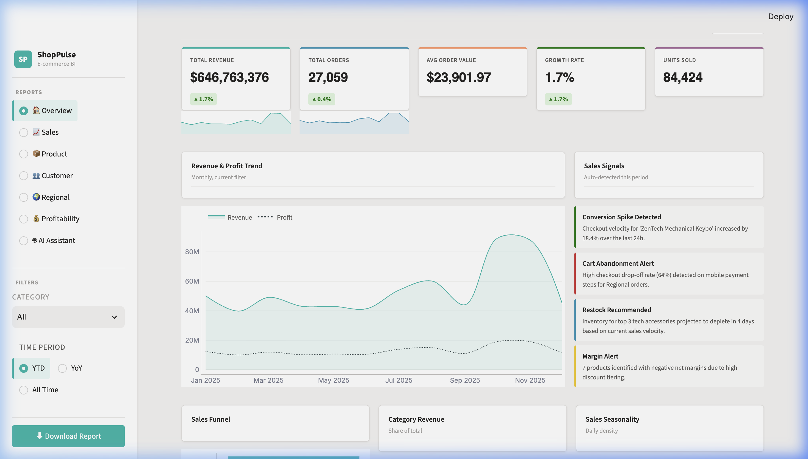
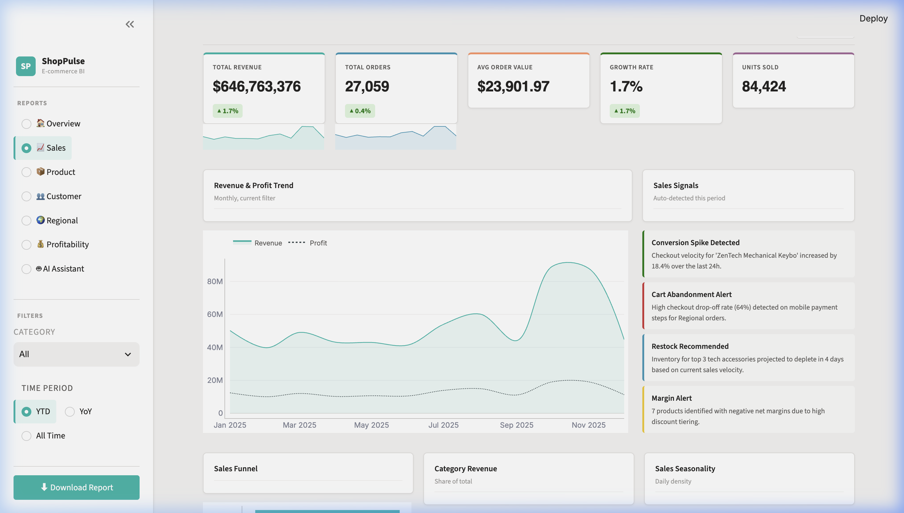
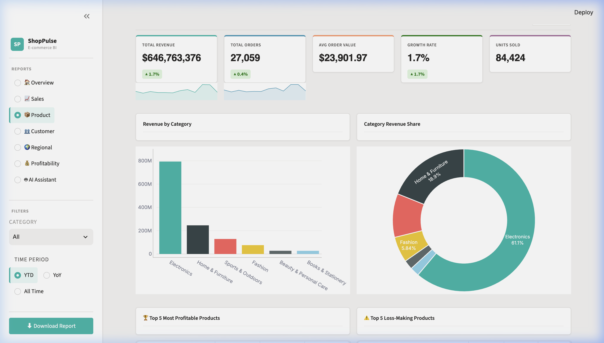
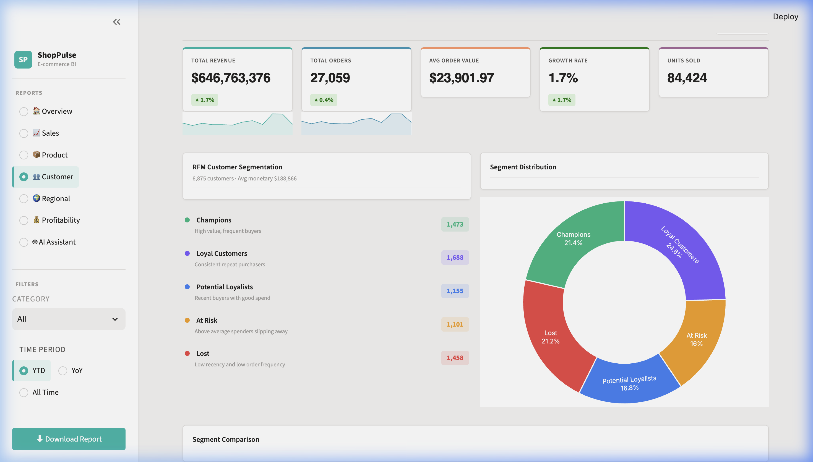
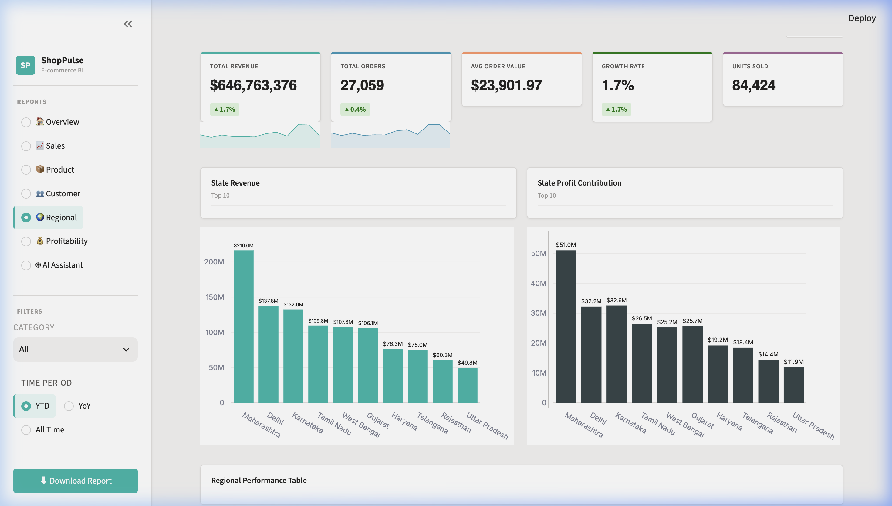
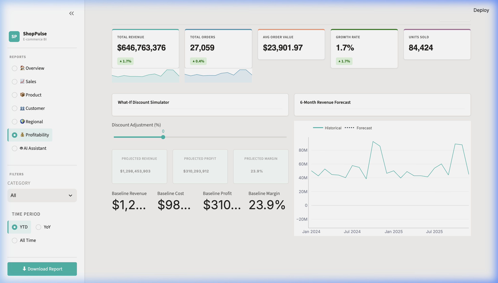

# ShopPulse — E-Commerce Business Intelligence Dashboard


> A premium, Power BI-inspired interactive BI dashboard for e-commerce analytics — built with **Python**, **Streamlit**, and **Plotly**.

---

## 📸 Screenshots

| Executive Overview | Sales Intelligence |
|---|---|
|  |  |

| Product Intelligence | Customer Intelligence |
|---|---|
|  |  |

| Regional Intelligence | Profitability & Forecast |
|---|---|
|  |  |

---

## 🚀 Features

- **Executive Overview** — KPI cards, revenue & profit trends, sales signals, funnel analysis, category treemap, seasonality heatmap, daily pattern
- **Sales Intelligence** — Time-series analysis, order trends, sales funnel, seasonality patterns
- **Product Intelligence** — Category revenue breakdown, revenue share donut chart, top profitable & loss-making products
- **Customer Intelligence** — RFM segmentation (Champions, Loyal, At Risk, Lost), segment distribution
- **Regional Intelligence** — State-level revenue & profit contribution, regional performance table
- **Profitability & Forecast** — What-If discount scenario simulator, 6-month revenue forecast
- **AI Analytics Assistant** — Natural language Q&A on live business data

---

## 🏗️ Project Structure

```
ShopPulse/
│
├── README.md                         # This file
├── LICENSE                           # MIT License
├── .gitignore                        # Git ignore rules
├── requirements.txt                  # Python dependencies
├── app.py                            # Streamlit dashboard (main entry)
├── .streamlit/config.toml            # Streamlit theme configuration
│
├── data/                             # Raw transactional CSVs
│   ├── orders.csv
│   ├── customers.csv
│   ├── products.csv
│   ├── region.csv
│   ├── payments.csv
│   ├── sample/
│   │   └── sample_data.csv           # Sample data for quick testing
│   └── README.md                     # Data dictionary
│
├── database/                         # SQL schema & analytics
│   ├── create_tables.sql             # Table creation DDL
│   ├── indexes.sql                   # Performance indexes
│   └── analytics_queries.sql         # Pre-built analytics queries
│
├── python/                           # Standalone Python analytics scripts
│   ├── data_cleaning.py              # ETL & data preprocessing
│   ├── eda.py                        # Exploratory data analysis
│   ├── rfm_analysis.py               # RFM customer segmentation
│   └── forecasting.py                # Revenue forecasting model
│
├── sql/
│   └── business_queries.sql          # Business-level SQL queries
│
├── powerbi/
│   └── ShopPulse.pbix                # Power BI report file (placeholder)
│
├── outputs/                          # Generated analysis outputs
│   ├── customer_rfm.csv              # RFM segmentation export
│   └── forecast_output.csv           # Forecast results export
│
├── screenshots/                      # Dashboard screenshots
│   ├── 01-executive-overview.png
│   ├── 02-sales-intelligence.png
│   ├── 03-product-intelligence.png
│   ├── 04-customer-intelligence.png
│   ├── 05-regional-intelligence.png
│   └── 06-profitability-forecast.png
│
└── docs/                             # Documentation
    ├── architecture.md               # System architecture
    ├── data_dictionary.md            # Full data dictionary
    └── business_metrics.md           # Business metrics definitions
```

---

## ⚙️ Tech Stack

| Layer | Technology |
|---|---|
| **Language** | Python 3.10 |
| **Dashboard** | Streamlit 1.61 |
| **Visualization** | Plotly (interactive) |
| **Data Processing** | Pandas, NumPy |
| **Machine Learning** | Scikit-learn, Statsmodels |
| **Database** | SQL (PostgreSQL/MySQL compatible DDL) |
| **BI Tool** | Power BI (optional `.pbix` included) |

---

## 🛠️ Setup & Installation

### Prerequisites
- Python 3.10+
- Conda (recommended) or pip

### Option 1: Conda (Recommended)
```bash
# Clone the repository
git clone https://github.com/YOUR_USERNAME/ShopPulse.git
cd ShopPulse

# Create environment
conda create -n shopplus python=3.10 -y
conda activate shopplus

# Install dependencies
pip install -r requirements.txt
```

### Option 2: pip
```bash
pip install -r requirements.txt
```

### Run the Dashboard
```bash
streamlit run app.py
```

Open your browser at **http://localhost:8501**

---

## 📊 Data Sources

The project uses **5 transactional CSV datasets** (96,000+ rows):

| File | Description | Key Columns |
|---|---|---|
| `orders.csv` | Sales transactions | Order_ID, Sales, Profit, Quantity, Discount |
| `customers.csv` | Customer profiles | Customer_ID, Name, Segment, City, State |
| `products.csv` | Product catalog | Product_ID, Category, Sub_Category, Brand |
| `region.csv` | Geographic data | Region_ID, Country, State, City |
| `payments.csv` | Payment methods | Payment_ID, Payment_Method |

See [docs/data_dictionary.md](docs/data_dictionary.md) for the complete data dictionary.

---

## 📈 Key Business Metrics

| Metric | Description |
|---|---|
| Total Revenue | Sum of all Sales |
| Total Orders | Count of unique Order_IDs |
| Average Order Value (AOV) | Revenue / Orders |
| Profit Margin % | (Total Profit / Total Revenue) × 100 |
| Growth Rate % | Period-over-period revenue growth |
| RFM Score | Recency × Frequency × Monetary segmentation |

See [docs/business_metrics.md](docs/business_metrics.md) for all metric definitions.

---

## 🧠 Analytics Modules

### Python Scripts (`python/`)
- **`data_cleaning.py`** — ETL pipeline: date parsing, numeric sanitization, star-schema merge
- **`eda.py`** — Exploratory analysis: distributions, correlations, outliers
- **`rfm_analysis.py`** — RFM customer segmentation with quantile scoring
- **`forecasting.py`** — Time-series revenue forecasting (linear trend + seasonality)

### SQL (`database/` & `sql/`)
- **`create_tables.sql`** — Schema DDL for all 5 tables
- **`indexes.sql`** — Optimized indexes for analytics workloads
- **`analytics_queries.sql`** — Pre-built analytical queries (KPIs, funnel, RFM)
- **`business_queries.sql`** — Business-facing SQL queries

---

## 📄 License

This project is licensed under the MIT License — see [LICENSE](LICENSE) for details.

---

## 🙋 Author

**Your Name**
- GitHub: [@YOUR_USERNAME](https://github.com/YOUR_USERNAME)
- LinkedIn: [Your LinkedIn](https://linkedin.com/in/YOUR_PROFILE)

---

> Built with ❤️ for data-driven e-commerce decision making.
