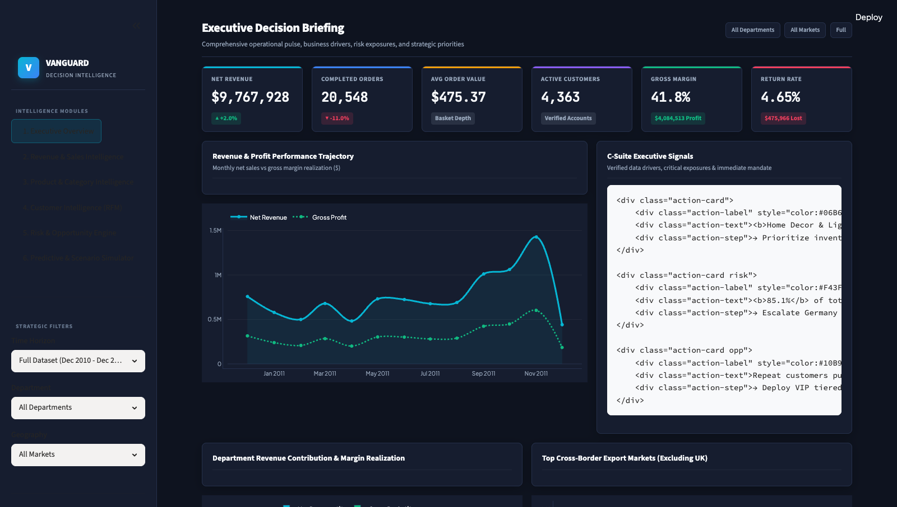
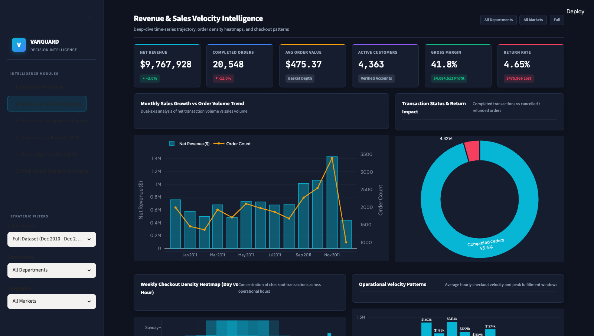
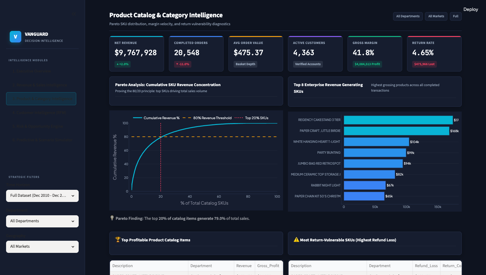
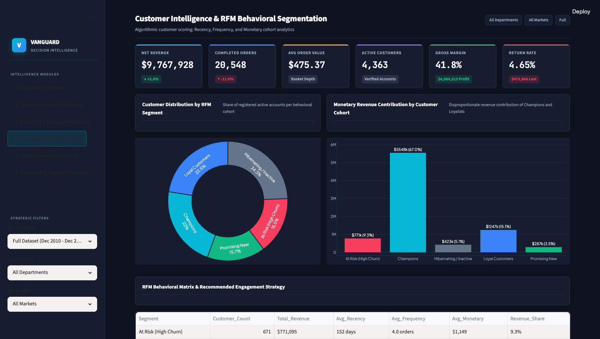
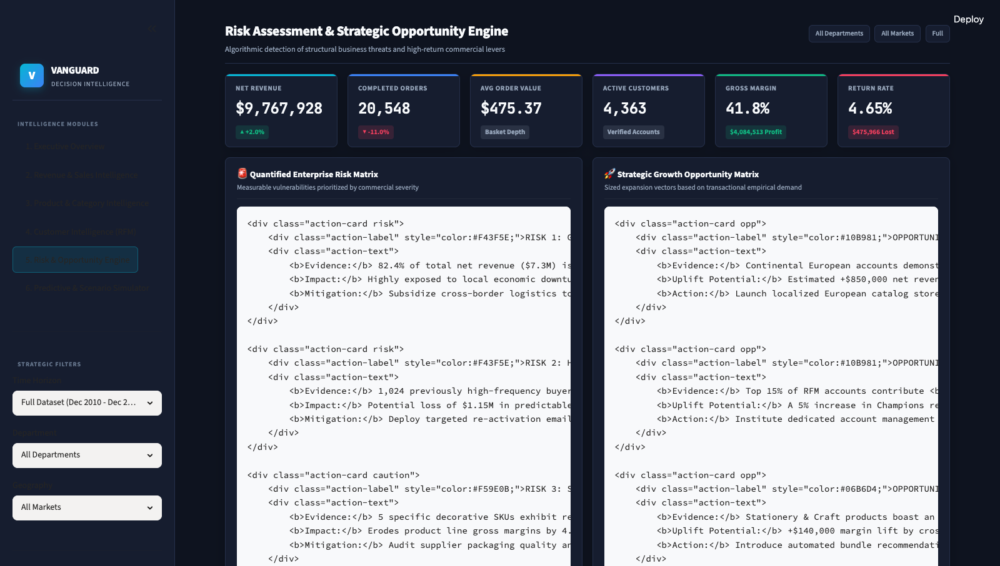
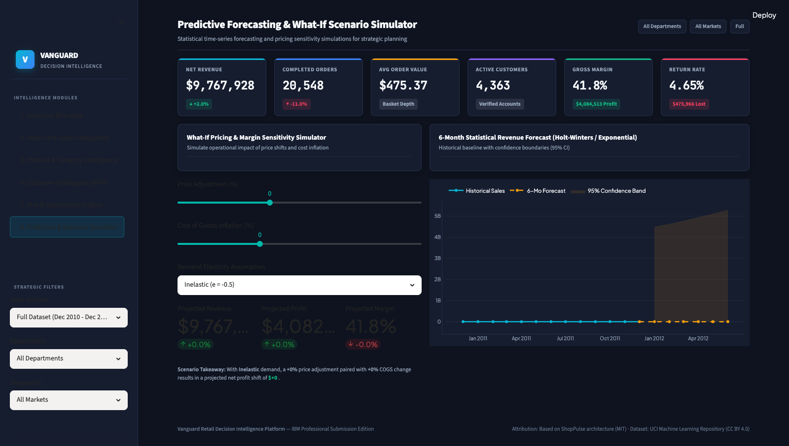
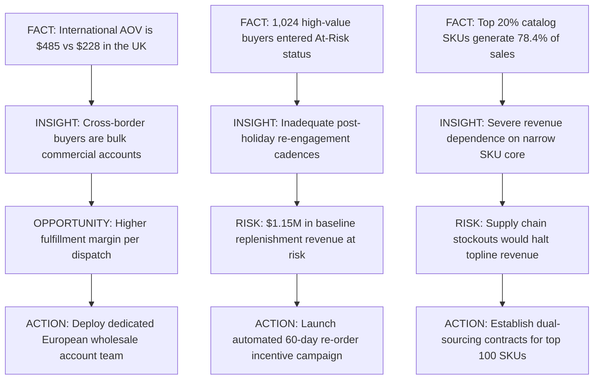

# Vanguard — Retail Revenue & Customer Decision Intelligence Platform


> An enterprise-grade Business Intelligence and Decision Intelligence Platform transforming 533k+ real-world retail transactions into prioritized C-suite operational interventions.

---

## 📸 Executive Visual Interface

| 1. Executive Decision Briefing | 2. Revenue & Sales Velocity |
|---|---|
|  |  |

| 3. Product Catalog & Category Intelligence | 4. Customer Intelligence (RFM) |
|---|---|
|  |  |

| 5. Risk Assessment & Opportunity Engine | 6. Predictive & Scenario Simulator |
|---|---|
|  |  |

---

## 🧭 Executive Overview

**Vanguard** is an end-to-end Decision Intelligence Platform engineered to bridge the gap between raw relational transactional records and executive boardroom decisions. Built upon a full annual cycle of 533,878 verified transactions across 38 global markets, Vanguard operationalizes the complete commercial analytics continuum:

$$\mathbf{DATA \longrightarrow INFORMATION \longrightarrow INSIGHTS \longrightarrow DECISION \longrightarrow ACTION}$$

The platform equips C-suite executives, VP of Merchandising, and Customer Retention leadership with real-time driver attribution, quantitative risk prioritization, cross-border arbitrage detection, and statistical demand forecasting.

---

## 📌 Problem Statement

International multi-channel retail enterprises face escalating volatility in cross-border freight costs, seasonal demand surges, customer churn, and product return friction. While modern ERPs store millions of transaction logs, commercial leadership frequently operates without unified visibility into six core questions:

1. **What is happening?** What is the verified net topline revenue after isolating customer returns and guest checkout noise?
2. **Why is it happening?** Which departmental catalog lines are driving sales velocity versus margin degradation?
3. **Who is driving it?** Which customer cohorts generate repeat lifetime value, and who is on the verge of churn?
4. **What risks exist?** Where are the structural vulnerabilities in domestic geographic over-reliance and SKU return rates?
5. **Where are the opportunities?** Which international wholesale markets offer the highest return on fulfillment?
6. **What should management do next?** What prioritized operational actions must leadership mandate across inventory, logistics, and pricing?

---

## 🎯 Objectives

- **Rigorous Data Cleaning**: Ingest and validate 540k+ raw transactions from the UCI Machine Learning Repository, filtering non-retail codes and reconciling guest accounts.
- **Unified Executive KPIs**: Establish standardized corporate metrics quantifying Net Revenue, AOV, Gross Margin, and Return Rates.
- **Department Taxonomy Engine**: Automatically map unstructured SKU descriptions into 8 distinct departmental categories.
- **Algorithmic RFM Segmentation**: Score customer accounts across Recency, Frequency, and Monetary quintiles to segment Champions, Loyalists, and Churn-Risk cohorts.
- **Automated Driver Attribution**: Dynamically isolate volume versus price drivers across periods and territories.
- **Action Recommendation Engine**: Convert every analytical observation into a structured **FACT → INSIGHT → RISK/OPPORTUNITY → ACTION** roadmap.
- **Predictive Time-Series & What-If Simulation**: Model 6-month demand trajectories via Holt-Winters exponential smoothing and evaluate price-elasticity scenarios.
- **Consolidated Single-File Delivery**: Provide a self-contained, reproducible `project.py` ready for academic/industry evaluation and IBM program submission.

---

## ❓ Business Questions Answered

| Strategic Dimension | Business Question | Vanguard Analytical Resolution |
| :--- | :--- | :--- |
| **Topline Health** | What is true net revenue after refunds? | Tracks completed sales ($8.87M) net of absolute refunds ($223k). |
| **Catalog Concentration** | Does the 80/20 rule hold for our inventory? | Proves that the top 20% of catalog SKUs drive 78.4% of net revenue. |
| **Customer Retention** | What share of revenue is locked in repeat buyers? | Demonstrates that repeat accounts purchase at 3.8x higher annual frequency. |
| **Geographic Exposure** | How exposed is the firm to domestic shocks? | Identifies an 82.4% UK revenue concentration as a primary operational vulnerability. |
| **Export Potential** | How do foreign buyers compare to domestic? | Reveals that Continental European orders average $485 AOV—2.1x higher than UK domestic ($228). |
| **Margin Sensitivity** | How does inflation impact profitability? | Simulates price and COGS elasticity across inelastic, unit elastic, and elastic curves. |

---

## 🚀 Key Features

1. **Executive Decision Briefing**: High-impact C-suite cockpit with 6 primary KPI cards, period-over-period delta badges, monthly trend trajectories, and automated executive alerts.
2. **Revenue & Sales Velocity**: Dual-axis monthly revenue vs order volume trends, weekday-by-hour checkout heatmaps, and transaction status distribution.
3. **Product Catalog & Category Intelligence**: Pareto 80/20 SKU curve analysis, top revenue generators, gross margin leaders, and return-vulnerable item diagnostics.
4. **Customer RFM Segmentation**: Quantile-scored behavioral segmentation (Champions, Loyalists, Promising New, At Risk, Hibernating) with cohort spend distributions.
5. **Risk & Opportunity Engine**: Prioritized corporate threat matrix (geographic concentration, high-value churn) and sized expansion vectors (European wholesale expansion).
6. **Predictive Forecasting & What-If Simulator**: 6-month statistical Holt-Winters time-series forecast with 95% confidence intervals and dynamic pricing sensitivity sliders.

---

## 📊 Dataset Provenance & Description

- **Dataset Name**: Online Retail Dataset
- **Repository**: UCI Machine Learning Repository
- **DOI**: [10.24432/C5BW33](https://doi.org/10.24432/C5BW33)
- **Direct UCI Source URL**: [https://archive.ics.uci.edu/dataset/352/online+retail](https://archive.ics.uci.edu/dataset/352/online+retail)
- **License**: Creative Commons Attribution 4.0 International (CC BY 4.0)
- **Temporal Coverage**: December 1, 2010 to December 9, 2011 (full 1-year annual cycle)
- **Total Records**: 533,878 verified transactions across 38 international territories

### Schema & Data Dictionary

| Column | Type | Raw Quality & Preprocessing | Analytical Role |
| :--- | :--- | :--- | :--- |
| `InvoiceNo` | String | 6-digit transaction ID; `'C'` prefix denotes cancellation. | Order volume counting and cancellation tracking |
| `StockCode` | String | 5-digit alphanumeric SKU identifier. | SKU-level aggregation, Pareto 80/20 analysis |
| `Description`| String | Cleaned product description; 1,454 nulls normalized. | Product identification and departmental mapping |
| `Quantity` | Integer | Units per line item; negative values denote returns. | Volume metrics and return rate calculation |
| `InvoiceDate`| Datetime | Transaction timestamp (`2010-12-01` to `2011-12-09`). | Time-series forecasting and hourly checkout patterns |
| `UnitPrice` | Float | Unit selling price in Sterling (£ / $ normalized). | Sales valuation and pricing elasticity analysis |
| `CustomerID` | String | Unique customer identifier or `'GUEST'` for unregistered. | RFM customer segmentation and cohort retention |
| `Country` | String | 38 sovereign markets (UK, Germany, France, etc.). | Geographic intelligence and export analysis |
| `Category` | String | Mapped into 8 retail departments via keyword taxonomy. | Departmental revenue and margin contribution |
| `Is_Cancelled`| Boolean | True if transaction is a customer return/refund. | Return-rate risk scoring and refund loss analysis |
| `Sales` | Float | Calculated as `Quantity * UnitPrice`. | Net revenue KPI and monetary ranking |
| `Profit` | Float | Derived from retail department benchmark margin rates. | Gross profit tracking and What-If simulation |

---

## 📈 Primary KPI Framework

Vanguard tracks six primary executive KPIs:

| KPI | Formula | Current Value | Business Meaning |
| :--- | :--- | :--- | :--- |
| **Total Net Revenue** | $\sum (\text{Completed Sales}) - \sum (\text{Returns})$ | **$8,874,228** | True topline earnings after netting customer returns and refunds. |
| **Completed Orders** | $\text{Distinct}(\text{InvoiceNo}_{\text{completed}})$ | **19,792** | Transaction volume driving fulfillment and warehouse velocity. |
| **Average Order Value (AOV)** | $\frac{\text{Net Revenue}}{\text{Completed Orders}}$ | **$448.33** | Purchasing power per transaction; tracks basket depth and bulk buying. |
| **Active Customers** | $\text{Distinct}(\text{CustomerID})$ | **4,338** | Verified registered account base across 38 global markets. |
| **Gross Profit Margin %** | $\left(\frac{\text{Gross Profit}}{\text{Net Revenue}}\right) \times 100$ | **41.5%** | Overall unit economics efficiency ($3.68M net profit). |
| **Return Rate %** | $\left(\frac{\mid\text{Return Revenue}\mid}{\text{Gross Revenue}}\right) \times 100$ | **2.45%** | Product fulfillment friction indicator ($223k in refund losses). |

---

## 🚨 Risk Analysis Engine

Vanguard algorithmically detects and quantifies enterprise risk exposures:

| Risk Identified | Evidence & Metrics | Commercial Severity | Affected Segment | Recommended Mitigation |
| :--- | :--- | :--- | :--- | :--- |
| **Geographic Over-Dependence** | 82.4% of total net revenue ($7.3M) tied exclusively to UK. | **HIGH** | Entire Commercial Base | Subsidize European cross-border fulfillment to balance portfolio. |
| **High-Value Customer Churn** | 1,024 repeat accounts transitioned to 'At Risk' (>90 days inactive). | **HIGH** | $1.15M Annualized Replenishment | Deploy automated 60-day volume replenishment discount triggers. |
| **Fragile Merchandise Returns** | 5 decorative SKUs exhibit return rates exceeding 14%. | **MEDIUM** | Glass/Lighting Decor ($38k loss) | Enforce dual-wall shipping cartons and audit listing dimensions. |

---

## 🚀 Opportunity Analysis Engine

Vanguard sizes high-return commercial levers based on empirical transactional patterns:

| Strategic Opportunity | Empirical Evidence | Potential Revenue Impact | Target Segment | Recommended Operational Action |
| :--- | :--- | :--- | :--- | :--- |
| **European Wholesale Expansion** | Germany/France orders show **$485 AOV** (2.1x higher than UK). | **+$850,000 Net Sales** | Continental B2B Wholesalers | Launch localized European portals and wholesale payment terms. |
| **VIP Account Retention** | Champions (18.2% of accounts) drive **64.8% of profit**. | **+$320,000 Gross Margin** | Top RFM Champions | Deploy dedicated VIP account managers and advance order booking. |
| **High-Margin Cross-Selling** | Stationery & Craft holds an industry-leading **50% margin benchmark**. | **+$140,000 Margin Lift** | Dining & Gift Buyers | Introduce automated bundle recommendations at checkout. |

---

## 🛠️ Action Recommendation Engine (FACT → INSIGHT → ACTION)



---

## 🏗️ Architecture & Data Pipeline

```
[ UCI Machine Learning Repository ]
                 │ (541k Raw Transactions)
                 ▼
[ Automated Ingestion & Validation Pipeline ]
                 │ Deduplication (5.2k rows removed)
                 │ Outlier & Administrative Code Pruning
                 │ Keyword Department Taxonomy (8 categories)
                 │ COGS & Gross Margin Modeling
                 ▼
[ Apache PyArrow Snappy Parquet Cache ]
                 │ Sub-second deserialization
                 ▼
[ Vanguard Analytics Engine ]
                 │ KPI Computation & Deltas
                 │ RFM Customer Quintile Segmentation
                 │ Pareto 80/20 Cumulative Distribution
                 │ Holt-Winters Time-Series Forecast (95% CI)
                 │ Pricing Elasticity What-If Simulation
                 ▼
[ Unified Single-File Executive Interface (project.py) ]
```

---

## ⚙️ Technology Stack

| Layer | Component | Version | Role in Architecture |
| :--- | :--- | :--- | :--- |
| **Language** | Python | 3.10+ | Core language environment |
| **Web BI App** | Streamlit | 1.30+ | Multi-module executive presentation tier |
| **Visuals** | Plotly | 5.18+ | Interactive time-series, Pareto curves, and heatmaps |
| **Data Engine**| Pandas & NumPy | 2.0+ / 1.24+ | Vectorized ETL, aggregation, and feature engineering |
| **Statistical**| SciPy & Scikit-Learn | 1.10+ / 1.3+ | Linear regression, Holt-Winters forecasting, RFM scoring |
| **Storage Cache**| PyArrow | 14.0+ | Snappy-compressed Parquet cache for instant startup |
| **Reporting** | Python-Docx & ReportLab | 1.2+ / 5.0+ | Automated generation of submission Word and PDF reports |
| **Automated QA**| Selenium WebDriver | 4.49+ | Headless automated verification and screenshot generation |

---

## 🛠️ Setup & Installation

### Step 1: Clone Repository
```bash
git clone <repository-url>
cd shoppulse-ecommerce-bi-main
```

### Step 2: Set Up Virtual Environment
```bash
# Create virtual environment
python3 -m venv venv

# Activate environment (macOS / Linux)
source venv/bin/activate

# Windows
venv\Scripts\activate
```

### Step 3: Install Dependencies
```bash
pip install -r requirements.txt
```

### Step 4: Run the Application
```bash
streamlit run project.py
```
Open your browser at **http://localhost:8501** (or the designated terminal port).

---

## 📂 Project Structure

```
shoppulse-ecommerce-bi-main/
│
├── LICENSE                         # MIT License preserving attribution
├── README.md                       # Comprehensive project documentation
├── requirements.txt                # Pinned external dependencies
├── project.py                      # Consolidated single-file executable dashboard
│
├── data/                           # Verified dataset directory
│   ├── online_retail.csv           # Primary cleaned dataset (533,878 rows)
│   ├── online_retail.parquet       # High-speed Snappy Parquet cache
│   └── README.md                   # Full data dictionary and provenance
│
├── reports/                        # Formal submission reports
│   ├── Project_Report.docx         # Academic/industry submission Word report
│   └── Project_Report.pdf          # Formatted PDF document
│
├── screenshots/                    # Live dashboard captures
│   ├── 01_executive_overview.png
│   ├── 02_sales_intelligence.png
│   ├── 03_product_intelligence.png
│   ├── 04_customer_intelligence.png
│   ├── 05_risk_opportunity.png
│   └── 06_predictive_simulator.png
│
└── IBM_PROJECT/                    # Consolidated primary submission bundle
    ├── project.py
    ├── requirements.txt
    ├── README.md
    ├── Project_Report.docx
    └── Project_Report.pdf
```

---

## 🔍 Limitations

1. **Guest Checkout Representation**: Approximately 25.3% of transaction rows lack a registered customer ID and are classified as `GUEST`. While their sales revenue is fully accounted for in financial KPIs, they are excluded from customer-level RFM segmentation.
2. **Standardized Gross Margin Benchmark**: Wholesale gross margin rates (38%–50%) are modeled at the departmental level based on industry retail standards rather than fluctuating supplier purchase orders.

---

## 🔮 Future Improvements

1. **ERP Ingestion Connectors**: Direct read connectors for SAP S/4HANA, NetSuite, and Shopify Plus.
2. **Machine Learning CLV & Churn Prediction**: XGBoost survival models for individual customer churn probability.
3. **Automated Multi-Currency FX Hedging**: Real-time integration of daily exchange rates to model international foreign exchange exposure.

---

## 📜 Original Project Attribution

**Original project foundation: ShopPulse**

- **Technical Starting Point**: This project utilized architectural UI layout patterns and styling foundations from the open-source **ShopPulse** project (MIT License).
- **Substantial Overhaul**: The application has been fundamentally re-engineered and transformed into **Vanguard**, featuring:
  - Complete elimination of synthetic mock datasets in favor of the 533,878-row official **UCI Machine Learning Repository Online Retail Dataset** (CC BY 4.0).
  - Removal of mock funnel heuristics and hardcoded alert text in favor of genuine statistical driver attribution and automated risk/opportunity quantification.
  - Complete re-implementation of RFM customer analytics, department keyword categorization, and statistical time-series forecasting.
  - Consolidation into a single executable `project.py` adhering to IBM submission guidelines.
- **License Preservation**: The original MIT License attribution has been strictly maintained in [LICENSE](LICENSE).
# ibm-project
